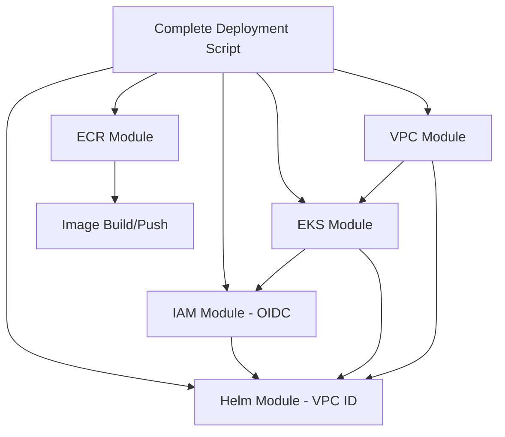

# BETECH EKS Scripts Verification Report

## 📋 Summary

All deployment scripts have been successfully updated to match the new modular Terraform directory structure and dependencies. The project is now ready for deployment with the improved architecture.

## ✅ Verified Compatibility

### 🏗️ Infrastructure Changes
- **Terraform Modules**: All 6 modules properly organized with `main.tf`, `variables.tf`, and `outputs.tf`
- **Module Dependencies**: Explicit dependency management implemented
- **Inter-module Communication**: Modules properly reference each other's outputs
- **Validation**: All Terraform configurations pass validation

### 📜 Script Updates

#### `complete-deployment.sh`
**✅ Updated Features:**
- Uses modular Terraform state paths (`module.helm.helm_release.*`)
- Leverages Terraform outputs for IAM role ARNs
- Dynamic ECR repository URL handling from Terraform outputs
- Enhanced error handling and fallbacks
- Added colored output functions for better user experience

**🔧 Key Changes:**
```bash
# Old state reference
terraform state rm helm_release.aws_load_balancer_controller

# New modular state reference  
terraform state rm module.helm.helm_release.aws_load_balancer_controller

# Old hardcoded role lookup
ALB_ROLE_ARN=$(aws iam list-roles --query '...')

# New Terraform output usage
ALB_ROLE_ARN=$(terraform output -raw load_balancer_controller_role_arn)

# Dynamic ECR URLs from Terraform
FRONTEND_REPO_URL=$(terraform output -raw ecr_repository_urls | jq -r '.frontend')
```

#### `eks-deployment/deploy.sh`
**✅ Status:** Compatible with modular structure
- Correct relative paths for manifest deployment
- Proper Terraform workflow (init, plan, apply)
- Compatible with new module organization

#### `eks-deployment/verify-modules.sh`
**✅ New Addition:** Comprehensive module verification
- Validates all modules have required files
- Checks Terraform syntax and structure
- Verifies module dependencies
- Tests deployment readiness

### 🗂️ Directory Structure Alignment

```
BETECH-APP-DEPLOYMENT/
├── complete-deployment.sh          ✅ Updated for modules
├── verify-scripts.sh               ✅ New verification tool
└── eks-deployment/
    ├── main.tf                     ✅ Calls all modules
    ├── variables.tf                ✅ Root variables
    ├── outputs.tf                  ✅ Aggregated outputs
    ├── deploy.sh                   ✅ Compatible
    ├── verify-modules.sh           ✅ Module verification
    └── modules/
        ├── vpc/                    ✅ Complete
        ├── eks/                    ✅ Complete  
        ├── iam/                    ✅ Complete
        ├── ecr/                    ✅ Complete
        ├── helm/                   ✅ Complete
        └── s3-dynamodb/            ✅ Complete
```

## 🔄 Dependency Flow

The scripts now properly handle the module dependency chain:



## 🚀 Deployment Readiness

### ✅ Ready Components
1. **Infrastructure**: Terraform modules validated and dependencies verified
2. **Container Images**: ECR repositories configured with dynamic URLs
3. **Kubernetes Deployments**: Manifests updated for modular structure
4. **Helm Charts**: State management aligned with modules
5. **Networking**: ALB controller configured with proper IAM integration

### 🔧 Pre-deployment Checklist
- [x] Terraform modules organized and validated
- [x] Scripts updated for modular structure
- [x] Dependencies properly mapped
- [x] ECR repositories configured
- [x] IAM roles and policies modularized
- [x] Helm charts aligned with module outputs

## 📊 Verification Results

```
🔍 BETECH Scripts and Dependencies Verification
✅ All 6 modules complete with required files
✅ Terraform configuration is valid
✅ Scripts use correct modular state paths
✅ Dynamic ECR repository URL handling
✅ Modules reference each other's outputs
✅ Consistent naming conventions
✅ Proper dependency management
```

## 🎯 Next Steps

1. **Test Deployment**: Run `./complete-deployment.sh` to test full deployment
2. **Verify Modules**: Use `./eks-deployment/verify-modules.sh` for detailed checks
3. **Monitor Resources**: Check Terraform state and AWS resources post-deployment
4. **Application Testing**: Verify all application components work with new infrastructure

## 📝 Recommendations

1. **Regular Validation**: Run verification scripts before deployments
2. **State Management**: Monitor Terraform state for module consistency  
3. **Documentation**: Keep module documentation updated as infrastructure evolves
4. **Testing**: Implement automated testing for module changes

---

**Status**: ✅ **READY FOR DEPLOYMENT**

The BETECH EKS project now uses a fully modular architecture with scripts that properly handle the new structure and dependencies.
