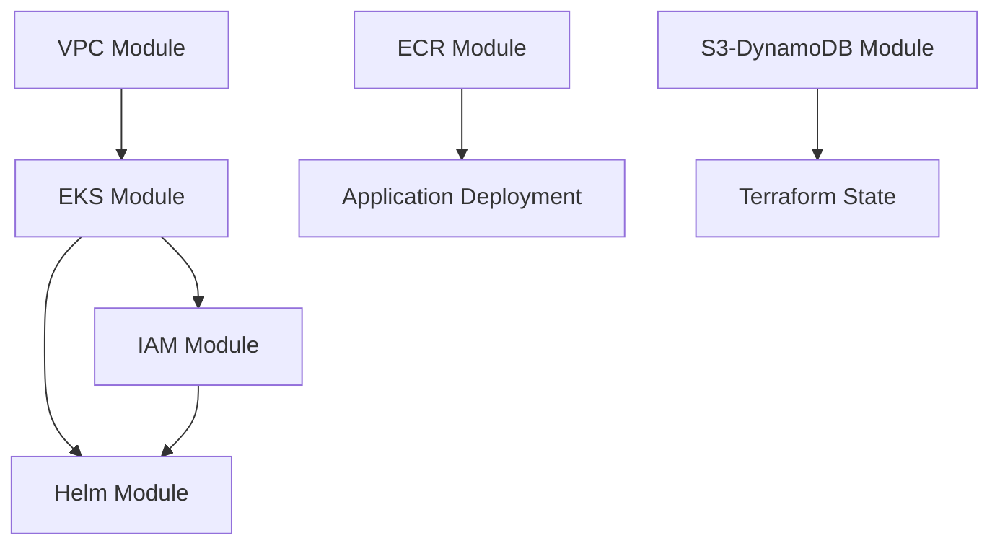

# BETECH EKS Terraform Deployment

This Terraform configuration deploys a complete EKS cluster with all necessary resources for the BETECH application.

## 🏗️ Architecture

The Terraform deployment creates:

- **EKS Cluster** with managed node groups
- **VPC** with public and private subnets across 3 AZs
- **ECR Repositories** for container images
- **IAM Roles** for AWS Load Balancer Controller, EBS CSI Driver, and Cluster Autoscaler
- **Helm Charts** for AWS Load Balancer Controller, Metrics Server, and Cluster Autoscaler
- **Security Groups** with appropriate ingress/egress rules
- **NAT Gateways** for private subnet internet access

## 📁 Project Structure

The Terraform configuration is organized into reusable modules:

```
eks-deployment/
├── main.tf                    # Root module calling all sub-modules
├── variables.tf               # Input variables
├── outputs.tf                 # Output values
├── providers.tf               # Provider configurations
├── backend.tf                 # Remote state configuration
├── terraform.tfvars           # Variable values
└── modules/
    ├── vpc/                   # VPC and networking resources
    │   ├── main.tf            # VPC module, subnets, security groups
    │   ├── variables.tf       # VPC input variables
    │   └── outputs.tf         # VPC outputs (IDs, CIDR blocks)
    ├── eks/                   # EKS cluster and node groups
    │   ├── main.tf            # EKS cluster configuration
    │   ├── variables.tf       # EKS input variables
    │   └── outputs.tf         # Cluster outputs (endpoint, OIDC)
    ├── iam/                   # IAM roles and policies
    │   ├── main.tf            # IAM roles for EKS services
    │   ├── variables.tf       # IAM input variables
    │   └── outputs.tf         # Role ARNs
    ├── ecr/                   # Container registries
    │   ├── main.tf            # ECR repositories
    │   ├── variables.tf       # ECR configuration
    │   └── outputs.tf         # Repository URLs
    ├── helm/                  # Helm charts for add-ons
    │   ├── main.tf            # ALB Controller, Metrics Server
    │   ├── variables.tf       # Helm chart versions
    │   └── outputs.tf         # Release status
    └── s3-dynamodb/           # Terraform state backend
        ├── main.tf            # S3 bucket and DynamoDB table
        ├── variables.tf       # Backend configuration
        └── outputs.tf         # Backend resource details
```

### Module Dependencies



## 📋 Prerequisites

1. **Terraform** (>= 1.0)
2. **AWS CLI** configured with appropriate credentials
3. **kubectl** for Kubernetes management
4. **helm** for Helm chart management

### Installation Commands

```bash
# Install Terraform
wget -O- https://apt.releases.hashicorp.com/gpg | gpg --dearmor | sudo tee /usr/share/keyrings/hashicorp-archive-keyring.gpg
echo "deb [signed-by=/usr/share/keyrings/hashicorp-archive-keyring.gpg] https://apt.releases.hashicorp.com $(lsb_release -cs) main" | sudo tee /etc/apt/sources.list.d/hashicorp.list
sudo apt update && sudo apt install terraform

# Install AWS CLI
curl "https://awscli.amazonaws.com/awscli-exe-linux-x86_64.zip" -o "awscliv2.zip"
unzip awscliv2.zip
sudo ./aws/install

# Install kubectl
curl -LO "https://dl.k8s.io/release/$(curl -L -s https://dl.k8s.io/release/stable.txt)/bin/linux/amd64/kubectl"
sudo install -o root -g root -m 0755 kubectl /usr/local/bin/kubectl

# Install Helm
curl https://raw.githubusercontent.com/helm/helm/main/scripts/get-helm-3 | bash
```

## 🚀 Quick Start

### 1. Configure AWS Credentials

```bash
aws configure
# Enter your AWS Access Key ID: [Your Access Key]
# Enter your AWS Secret Access Key: [Your Secret Key]
# Default region name: us-west-2
# Default output format: json
```

### 2. Deploy Infrastructure

```bash
# Navigate to terraform directory
cd terraform

# Make scripts executable
chmod +x deploy.sh validate.sh

# Deploy the infrastructure
./deploy.sh
```

### 3. Validate Deployment

```bash
# Run validation script
./validate.sh
```

## 🔧 Manual Deployment

If you prefer manual deployment:

```bash
# Initialize Terraform
terraform init

# Plan deployment
terraform plan

# Apply deployment
terraform apply

# Configure kubectl
aws eks update-kubeconfig --region us-west-2 --name betech-eks-cluster
```

## 📊 Terraform Resources

### Core Infrastructure
- **VPC Module**: Creates VPC with public/private subnets
- **EKS Module**: Creates EKS cluster with managed node groups
- **Security Groups**: Network security configuration

### IAM Resources
- **EBS CSI Driver Role**: For persistent volume management
- **Load Balancer Controller Role**: For ALB management
- **Cluster Autoscaler Role**: For automatic scaling

### Container Resources
- **ECR Repositories**: For application images
- **Helm Charts**: For cluster add-ons

### Networking
- **NAT Gateways**: For private subnet internet access
- **Internet Gateway**: For public subnet access
- **Route Tables**: For subnet routing

## 🔍 Configuration Options

### Variables (terraform.tfvars)

```hcl
# AWS Configuration
aws_region = "us-west-2"
environment = "production"

# EKS Configuration
cluster_version = "1.27"

# Node Group Configuration
node_group_instance_types = ["t3.medium", "t3.large"]
node_group_desired_capacity = 2
node_group_max_capacity = 10
node_group_min_capacity = 1

# VPC Configuration
vpc_cidr = "10.0.0.0/16"
private_subnets = ["10.0.1.0/24", "10.0.2.0/24", "10.0.3.0/24"]
public_subnets = ["10.0.101.0/24", "10.0.102.0/24", "10.0.103.0/24"]
```

## 📈 Monitoring and Scaling

### Cluster Autoscaler
- Automatically scales node groups based on demand
- Configured with proper IAM permissions
- Monitors pod scheduling and resource utilization

### Metrics Server
- Provides resource utilization metrics
- Enables Horizontal Pod Autoscaler
- Supports kubectl top commands

### AWS Load Balancer Controller
- Manages Application Load Balancers
- Supports ingress resources
- Provides advanced routing capabilities

## 🛠️ Troubleshooting

### Common Issues

1. **IAM Permissions**
   ```bash
   # Check current AWS identity
   aws sts get-caller-identity
   
   # Verify EKS cluster access
   aws eks describe-cluster --name betech-eks-cluster --region us-west-2
   ```

2. **kubectl Configuration**
   ```bash
   # Update kubeconfig
   aws eks update-kubeconfig --region us-west-2 --name betech-eks-cluster
   
   # Test connectivity
   kubectl cluster-info
   ```

3. **Node Group Issues**
   ```bash
   # Check node status
   kubectl get nodes
   
   # Describe node for details
   kubectl describe node <node-name>
   ```

4. **ALB Controller Issues**
   ```bash
   # Check ALB controller logs
   kubectl logs -n kube-system deployment/aws-load-balancer-controller
   
   # Verify service account
   kubectl get serviceaccount aws-load-balancer-controller -n kube-system
   ```

## 📤 Outputs

After successful deployment, Terraform provides:

- **Cluster Information**: Name, endpoint, security groups
- **VPC Details**: VPC ID, subnet IDs, CIDR blocks
- **ECR Repository URLs**: For pushing container images
- **IAM Role ARNs**: For service accounts
- **Configuration Commands**: kubectl and ECR login commands

## 🧹 Cleanup

To destroy all resources:

```bash
# Using the script
./deploy.sh destroy

# Or manually
terraform destroy
```

## 💰 Cost Optimization

### Resource Sizing
- Node groups use t3.medium/t3.large instances
- Cluster autoscaler reduces unused capacity
- Single NAT gateway option available

### Storage
- EBS volumes use gp3 for better cost/performance
- Lifecycle policies for ECR repositories

### Networking
- Private subnets reduce data transfer costs
- ALB provides efficient load balancing

## 🔒 Security Features

### Network Security
- Private subnets for worker nodes
- Security groups with minimal required access
- VPC Flow Logs for monitoring

### IAM Security
- Least privilege IAM roles
- Service accounts with Web Identity
- No hardcoded credentials

### Cluster Security
- Latest EKS version
- Encrypted EBS volumes
- Container image scanning

## 🚀 Next Steps

After infrastructure deployment:

1. **Build and Push Images**
   ```bash
   # Get ECR login command from Terraform output
   $(terraform output -raw ecr_login_command)
   
   # Build and push your images
   docker build -t betech-frontend .
   docker tag betech-frontend:latest 374965156099.dkr.ecr.us-west-2.amazonaws.com/betech-frontend:latest
   docker push 374965156099.dkr.ecr.us-west-2.amazonaws.com/betech-frontend:latest
   ```

2. **Deploy Applications**
   ```bash
   # Navigate to parent directory
   cd ..
   
   # Deploy Kubernetes manifests
   kubectl apply -f persistent-volume-claim/manifests/
   kubectl apply -f secrets.yaml
   kubectl apply -f postgres-deployment.yaml
   kubectl apply -f backend-deployment.yaml
   kubectl apply -f frontend-deployment.yaml
   kubectl apply -f ingress.yaml
   ```

3. **Configure DNS and SSL**
   - Point your domain to the ALB endpoint
   - Request SSL certificate in ACM
   - Update ingress with certificate ARN

## 📞 Support

For issues or questions:
- Check the troubleshooting section
- Review AWS EKS documentation
- Validate IAM permissions
- Check CloudWatch logs

## 📄 License

This Terraform configuration is provided as-is for the BETECH application deployment.